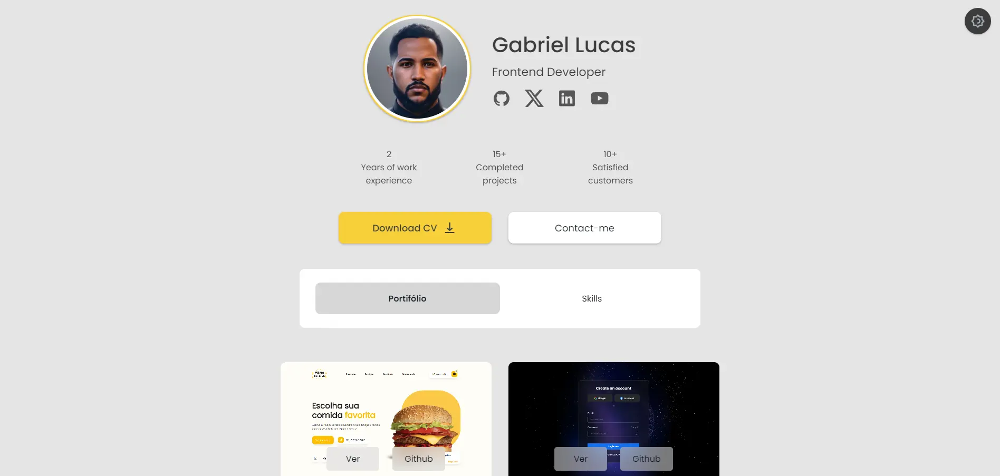

# Portfólio - Gabriel Lucas

Este é meu portfólio de desenvolvimento onde você encontrará minhas principais redes, projetos e habilidades.

## Como Acessar

- **[Portfólio](eugabrieldev.netlify.app)**: Confira meus projetos.

## Projetos

Aqui estão alguns dos meus projetos destacados:

1. **Burger**

   - [Ver](https://menudigitalio.netlify.app)
   - [GitHub](https://github.com/DevGabriel0402/cardapio-digital.io)

2. **Login**

   - [Ver](https://loginpage-io.netlify.app)
   - [GitHub](https://github.com/DevGabriel0402/Tela-de-Login)

3. **Preset**

   - [Ver](https://preset-io.netlify.app)
   - [GitHub](https://github.com/DevGabriel0402/presets-io)

4. **Convencily Test**

   - [Ver](https://convencily-test-frontend.netlify.app/)
   - [GitHub](https://github.com/DevGabriel0402/convencily-teste-frontend)

5. **Bio Link**

   - [Ver](https://linksaqui.netlify.app)
   - [GitHub](https://github.com/DevGabriel0402/linksUteis)

6. **Previsão do Tempo**
   - [Ver](https://previsaodotempo-io.netlify.app)
   - [GitHub](https://github.com/DevGabriel0402/WeatherApp-io)
